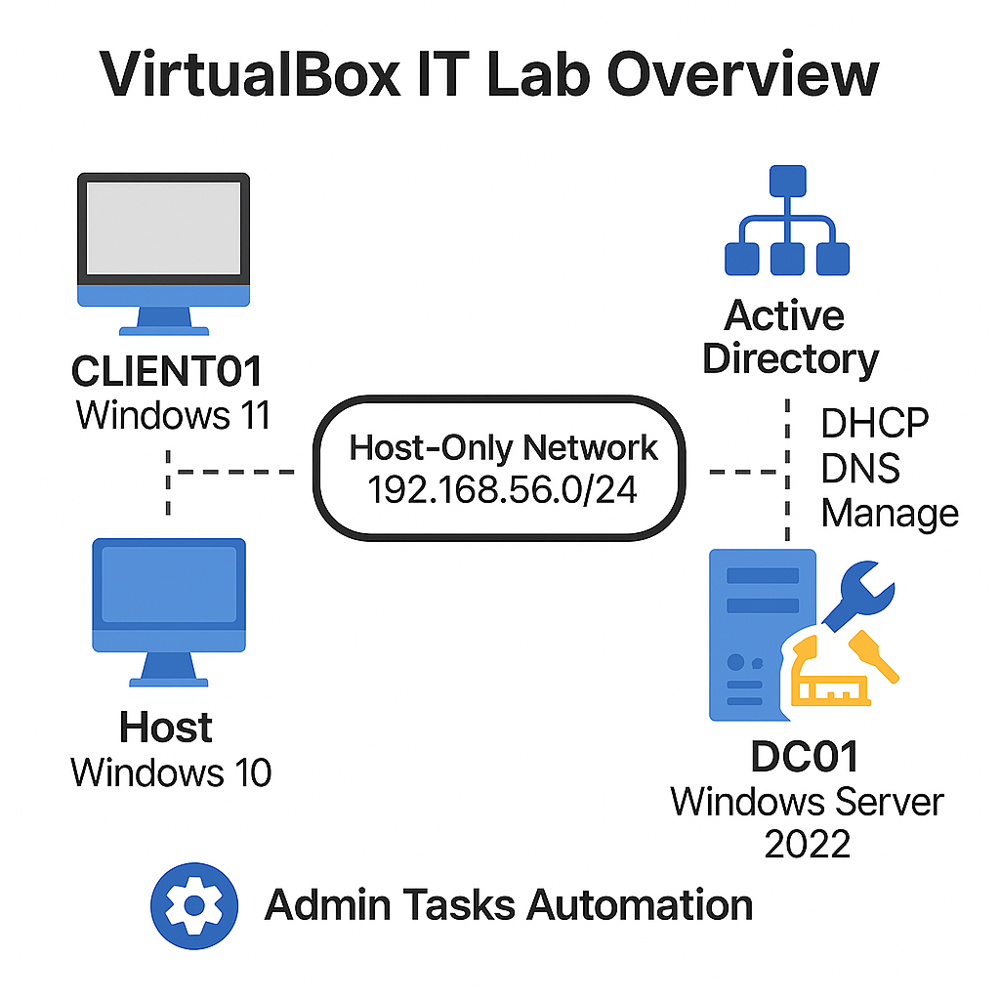
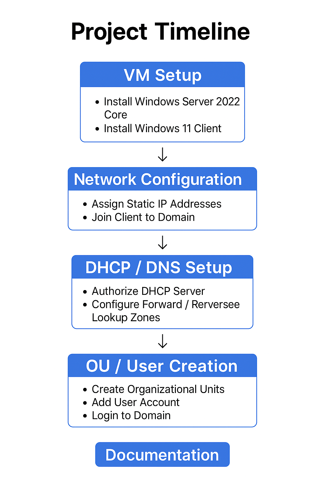
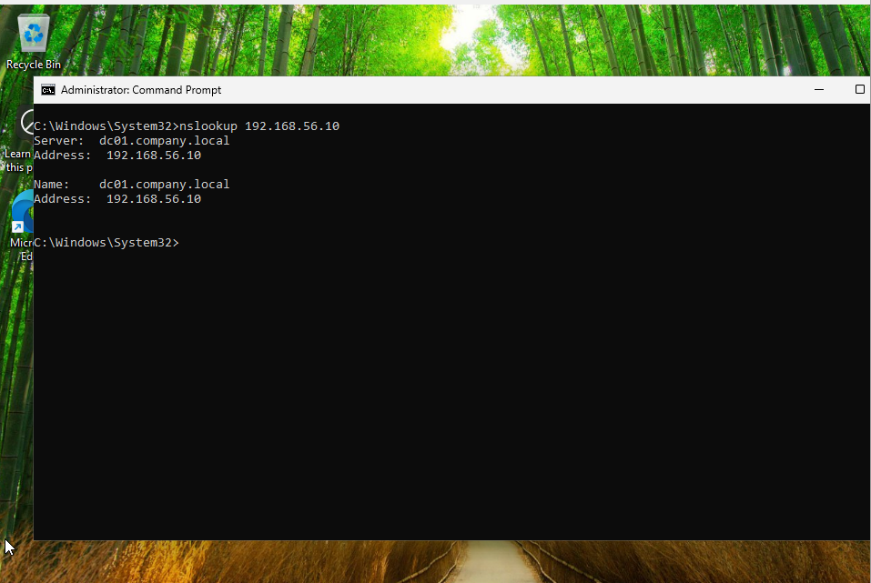
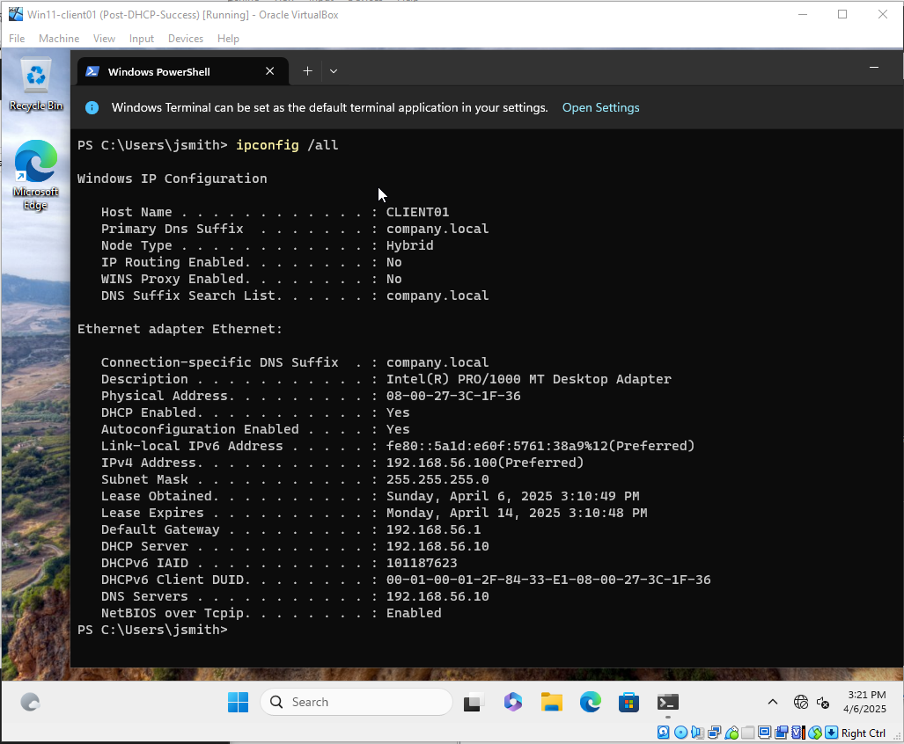

# 🧪 VirtualBox IT Lab Project Notes

## 🔧 Lab Setup Overview

- **Hypervisor**: VirtualBox  
- **Host OS**: Windows 10 Home  
- **Primary VMs**:
  - Windows Server 2022 (Core)
  - Windows 11 Pro  
- **Networking Mode**:
  - Adapter 1: Internal Network (`intnet`)
  - Adapter 2: NAT (optional for internet access)

---

## 📦 Lab Goals

- Practice Windows Server domain management  
- Implement DHCP, DNS, Active Directory, GPOs  
- Automate admin tasks with PowerShell  
- Demonstrate networking and system admin skills for employment

---

## 📌 Setbacks & Solutions Summary

| # | Setback                           | Resolution                                               |
|---|-----------------------------------|----------------------------------------------------------|
| 1 | Win11 Secure Boot/TPM            | Registry hack during install (LabConfig)                 |
| 2 | CLIENT01 couldn't ping DC01      | Changed adapter from NAT to Host-Only/Internal           |
| 3 | Reverse DNS lookup failed        | Created reverse zone + PTR record on DC01                |
| 4 | DHCP auth failed                 | Removed `-Credential`, ran as Domain Admin               |
| 5 | CN=Users confusion               | Switched from OU= to CN= for built-in container          |
| 6 | Domain login failed              | Fixed DNS misconfig and restarted CLIENT01               |
| 7 | Wrong DHCP server answered       | Switched to Internal Network to isolate lab              |

---

## 🧰 Configuration Notes

- **Static IPs**:
  - Server: `192.168.56.10`
  - Client: DHCP assigned (e.g., `192.168.56.100`)
- **Domain**: `company.local`  
- **Server Hostname**: `DC01`  
- **Client Hostname**: `CLIENT01`  
- **Client Local Username**: `****`  
- **Client Password**: `****`  
- **Domain Admin Password (DSRM/Admin)**: `****`  
- **Domain User Example**:
  - Username: `****`
  - Password: `****`

---

## ✅ Final Status

- [x] **Windows Server 2022 (Core)** installed and promoted to Domain Controller (DC01)  
- [x] **Active Directory Domain Services (AD DS)** fully functional (`company.local`)  
- [x] **DNS configured** with forward and reverse zones  
- [x] **DHCP role installed, authorized**, and handing out correct leases and DNS  
- [x] **Windows 11 Pro (CLIENT01)** successfully joined to domain  
- [x] **Domain user login verified** (`company\jsmith`)  
- [x] **PowerShell scripts created** to automate user + OU creation  
- [x] **Network migrated to Internal Network mode** to eliminate VirtualBox DHCP conflicts  
- [x] **Lab issues resolved and documented** as real-world troubleshooting examples  
- [x] **Project folder organized** for GitHub upload  

---

## 📝 Future Improvements

- Add more users and custom security groups  
- Implement Group Policy Objects (GPOs)  
  - Examples: restrict control panel, desktop background, drive mapping  
- Automate snapshot-based rollback before major changes  
- Add login script automation or logon event tracking  
- Create CSV-driven bulk user import  

---

## 📂 GitHub Upload Notes

Here’s how the project is organized:

<pre>
it-lab-projects/
├── active-directory-lab/
│   ├── scripts/
│   │   ├── create-users.ps1
│   │   └── create-ous.ps1
│   └── README.md
│
├── dhcp-dns-lab/
│   ├── scripts/
│   │   ├── configure-dhcp.ps1
│   │   └── set-scope-options.ps1
│   └── README.md
│
├── screenshots/
│   ├── client01-dhcp-domain-confirmation.png
│   ├── client01-login-as-jsmith.png
│   └── [additional screenshots]
│
├── automation/
|   ├── Configure-DHCP.ps1
|   ├── Create-LabUsers.ps1
|   ├── Install-ADDS.ps1
|   ├── README.md
|   ├── lab-config.ps1
|   └── lab-settings.json
│
├── diagrams/
|   ├── IT-Lab-Overview.png
|   └── project-timeline.png
|   
|
├── README.md  ← Project overview (this file) 
</pre>

### 🗃️ How to Use This Structure

- Each major section of the lab has its **own folder** with relevant scripts and documentation.
- All **PowerShell automation scripts** are inside `automation/` folders for clarity.
- **Screenshots** are placed in a central folder for easy referencing from Markdown.
- This layout makes it easy for employers or instructors to navigate your project.

---

## 🔗 Repository: [https://github.com/anonth42/it-lab-projects](https://github.com/anonth42/it-lab-projects)
